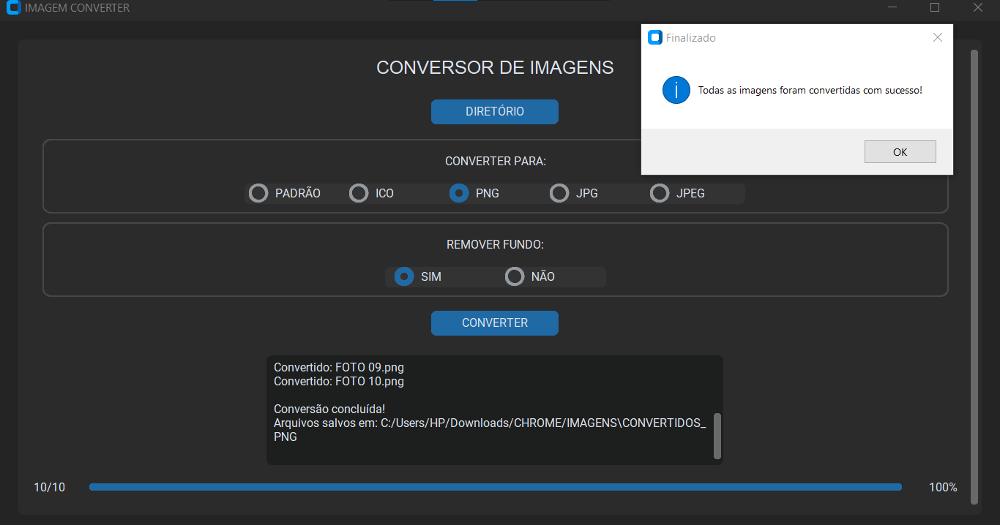
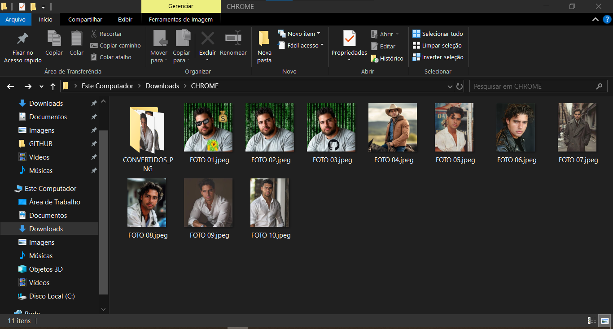
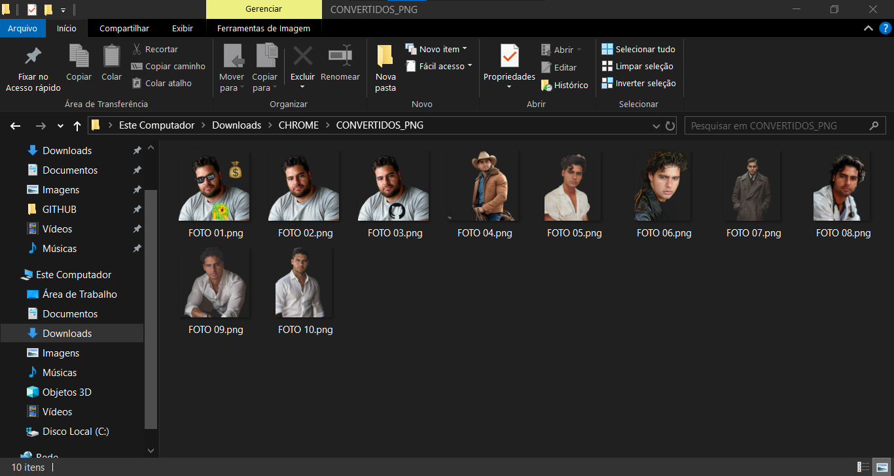

# IMAGEM CONVERTER
👨‍🏫USE ESSE APP PARA REMOVER O FUNDO DAS SUAS FOTOS E/OU CONVERTER PARA DIVERSOS FORMATOS.

 <br>
 <br>
 <br>

## DESCRIÇÃO:
Este aplicativo é uma ferramenta para **converter várias imagens** em diferentes formatos e, opcionalmente, **remover o fundo** das imagens. Desenvolvido com a biblioteca `customtkinter`, ele possui uma interface moderna e intuitiva que permite ao usuário:

* Selecionar um diretório com imagens.
* Escolher o formato de conversão.
* Optar pela remoção de fundo.
* Acompanhar o progresso da conversão com barra visual e status detalhado.

## FUNCIONALIDADES:
* Permite ao usuário escolher uma **pasta contendo imagens** para processamento em lote.

* Converte as imagens para os seguintes formatos:
  * **PADRÃO**: Mantém o formato original.
  * **ICO**: Ícones.
  * **PNG**: Suporta transparência.
  * **JPG / JPEG**: Formatos populares, sem suporte à transparência.

* **Remoção de Fundo (Opcional):**
  * **SIM**: Remove o fundo da imagem automaticamente.
  * **NÃO**: Mantém o fundo original.

* **Interface com Progresso:**
   * Barra de progresso animada.
   * Contador de imagens processadas.
   * Exibição percentual.
   * Caixa de status exibindo o nome (com extensão) de cada imagem convertida ou mensagens de erro.

* **Saída Organizada:**
   * As imagens convertidas são salvas em uma nova pasta dentro do diretório original, com nome no formato:

   ```
   CONVERTIDOS_<FORMATO>
   ```

## EXECUTANDO ESSE PROJETO:
1. **Instalação das Dependências:**
   - Entre no diretório `CODIGO` e execute o comando:

   ```bash
   pip install -r requirements.txt
   ```

2. **Executando o Código:**
   - Para executar o arquivo Python, utilize o comando abaixo no terminal, dentro do diretório `./CODIGO`:

   ```
   python CODIGO.py
   ```

3. **Selecionar um Diretório**:
   * Clique no botão **DIRETÓRIO** para abrir uma caixa de diálogo que permite escolher uma **pasta com imagens** do seu sistema de arquivos. O caminho do diretório selecionado será exibido no aplicativo.

4. **Escolher o Formato de Conversão**:
   * Em **CONVERTER PARA**, escolha o formato desejado para as imagens convertidas. As opções disponíveis são:

     * **PADRÃO**: Mantém o formato original.
     * **ICO**: Converte para formato de ícone.
     * **PNG**: Converte para formato PNG.
     * **JPG/JPEG**: Converte para formato JPG ou JPEG.

5. **Escolher a Remoção de Fundo**:
   * Em **REMOVER FUNDO**, selecione **SIM** se desejar remover o fundo das imagens, ou **NÃO** se preferir manter o fundo original.

6. **Converter as Imagens**:
   * Clique no botão **CONVERTER** para processar todas as imagens do diretório conforme as seleções feitas. O botão **CONVERTER** será habilitado ou desabilitado automaticamente com base nas opções escolhidas.

7. **Verificar o Resultado**:
   * Após o processamento, uma mensagem de sucesso será exibida informando que as imagens foram salvas corretamente no diretório **CONVERTIDOS\_<FORMATO>**. A barra de progresso e a caixa de status acompanharão o andamento da conversão em tempo real.

## NÃO SABE?
- Entendemos que para manipular arquivos em muitas linguagens, é necessário possuir conhecimento nessas áreas. Para auxiliar nesse aprendizado, oferecemos cursos gratuitos disponíveis:
* [CURSO DE PYTHON](https://github.com/VILHALVA/CURSO-DE-PYTHON)
* [CURSO DE CUSTOMTKINTER](https://github.com/VILHALVA/CURSO-DE-CUSTOMTKINTER)
* [SAIBA MAIS SOBRE O "REMBR"](https://github.com/danielgatis/rembg)
* [CONFIRA MAIS CURSOS](https://github.com/VILHALVA?tab=repositories&q=+topic:CURSO)

## CREDITOS:
- [PROJETO BASEADO NO "AUDIO CONVERTER" ](https://github.com/VILHALVA/AUDIO-CONVERTER)


